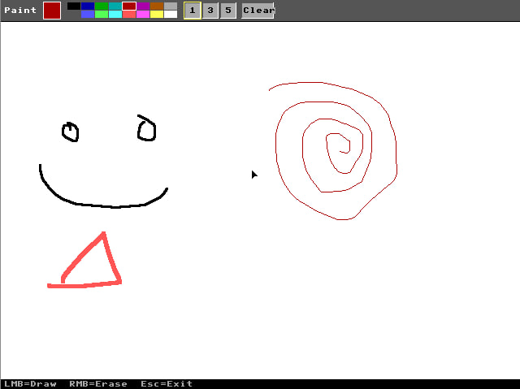
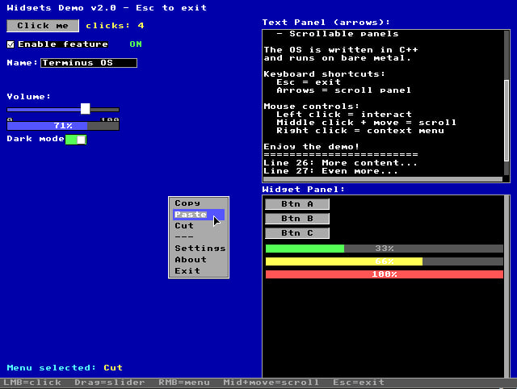
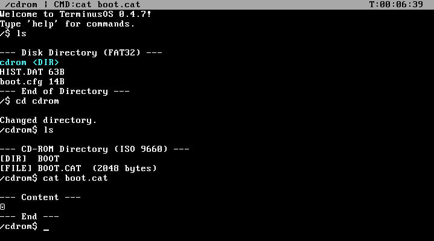
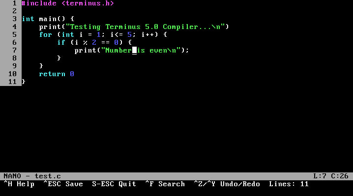
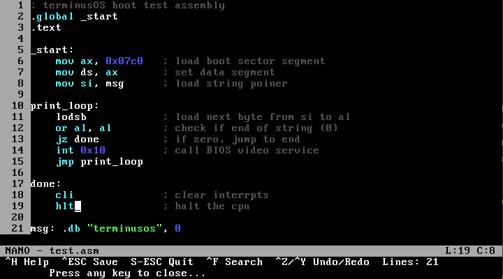
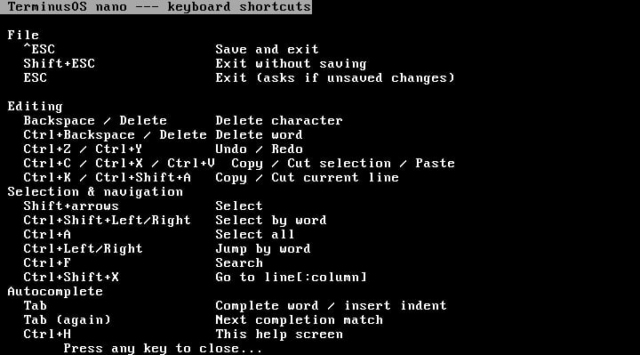

# 🛠 TerminusOS v0.4.7 — GUI & Graphics Update

> Major release: a real VGA graphics mode with mouse support and a GUI widget toolkit, a custom bootloader replacing GRUB, native CD-ROM (ISO 9660) support, and a heavily overhauled Nano editor.

---

## 🖱 VGA Graphics Mode & GUI Widgets

TerminusOS can now switch out of text mode into real VGA graphics — **640×480** (Mode X) with a working **PS/2 mouse cursor**, double-buffered rendering, and a small immediate-mode GUI toolkit: buttons, checkboxes, sliders, toggles, progress bars, text fields, scroll panels, and right-click context menus.

Two commands show it off:

**`gui`** — a small Paint-style drawing app. Toolbar with a 16-color palette and pen size, left-click to draw, right-click/menu to clear.

```
gui
```



**`widgets`** — a showcase of every widget: sliders you can drag, toggles, a scrollable text panel (mouse wheel or arrow keys), and a right-click context menu.

```
widgets
```



---

## 💿 New Bootloader & CD-ROM Support

GRUB is gone. TerminusOS now boots through its own two-stage MBR bootloader (`boot/stage1.asm` + `boot/stage2.asm`), and `build.sh` produces two artifacts from the same image:

- **`disk.img`** — a raw bootable disk image, write it to a USB stick or virtual HDD with `dd`.
- **`Terminus_OS.iso`** — the same `disk.img` embedded via El Torito **no-emulation** boot, so it boots identically from a CD-ROM.

```
./build.sh        # both ISO and disk.img
./build.sh disk    # disk.img only
./build.sh iso     # ISO only
```

On top of that, the kernel now speaks **ATAPI** and reads real **ISO 9660** filesystems — if a CD-ROM is present at boot, it's auto-detected and mounted as a virtual `/cdrom` folder. It shows up right in `ls` at the root, and `cd`, `ls`, `cat`, and `nano`/`edit` all work transparently inside it (read-only, as you'd expect from a CD).

```
ls              # shows "cdrom <DIR>" at the root if a disc is mounted
cd /cdrom
ls
cat boot.cat
```



---

## 📝 Nano Editor — Another Major Overhaul

Nano got rebuilt again since 0.4.3, on every axis:

- **Much bigger buffer** — 200 → **1024 lines**, line width 79 → **256 characters**, with horizontal scrolling for long lines.
- **Basic syntax highlighting** for C/C++ and x86 assembly (auto-detected by file extension `.c/.h/.cpp/.hpp` / `.asm/.s`) — keywords, strings, comments, preprocessor directives, brackets, and numbers, each in their own color, correctly following the active theme's background.
- **Tab autocompletion** — completes the word under the cursor from language keywords and identifiers already used in the file; press Tab again to cycle to the next match.
- **Line & block editing** — `Ctrl+K`/`Ctrl+Shift+A` to copy/cut the current line, `Ctrl+C`/`Ctrl+X`/`Ctrl+V` for selections, `Ctrl+A` to select all.
- **Word-wise navigation** — `Ctrl+←/→` to jump by word, `Ctrl+Shift+←/→` to select by word, `Ctrl+Backspace`/`Ctrl+Delete` to delete a whole word.
- **Go to line\:column** — `Ctrl+Shift+X` jumps straight to a position; typing a line past the end of the file pads it with blank lines to get there, and a column past the end of a line just lands you at its end.
- **Full-screen help** — `Ctrl+H` opens a dedicated shortcut reference screen (the old one-line status bar couldn't fit it all anymore).

#### cpp

#### asm

#### Help for nano


---

## 👨‍💻 Author

- **YouTube:** [Zero Logic](https://www.youtube.com/@Zero-Logic-dev)
- **Telegram:** [@den2010991](https://telegram.me/den2010991)
