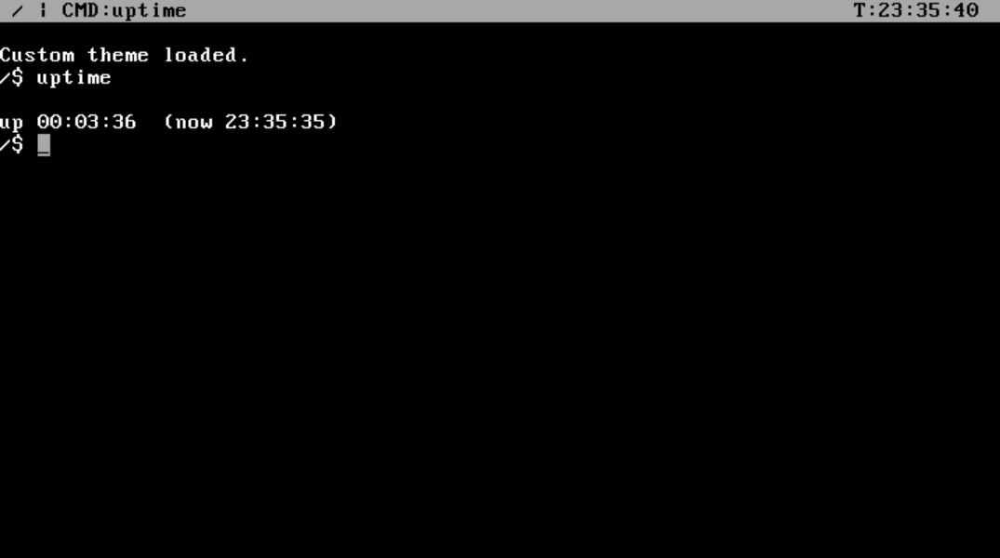
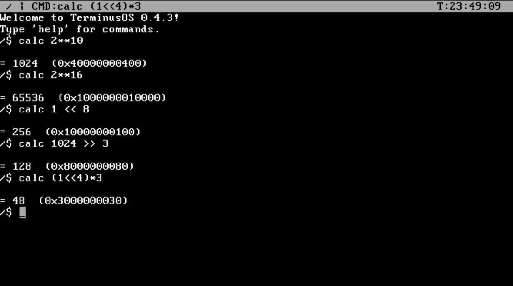
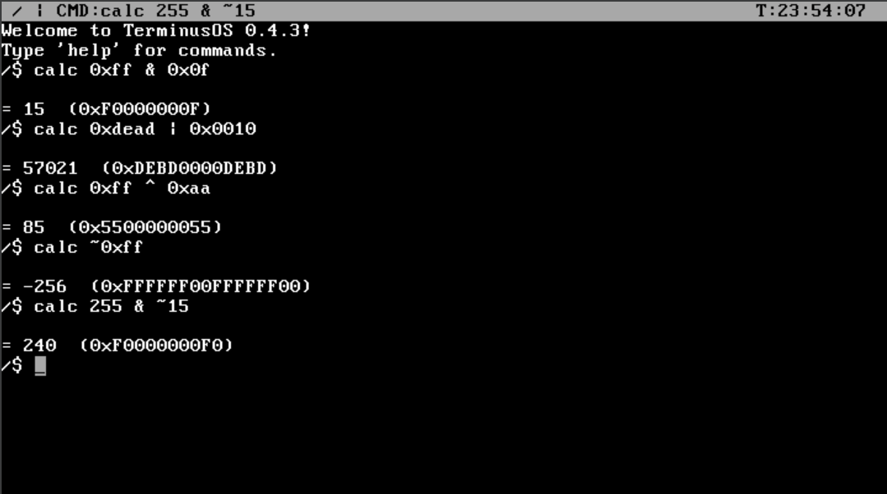
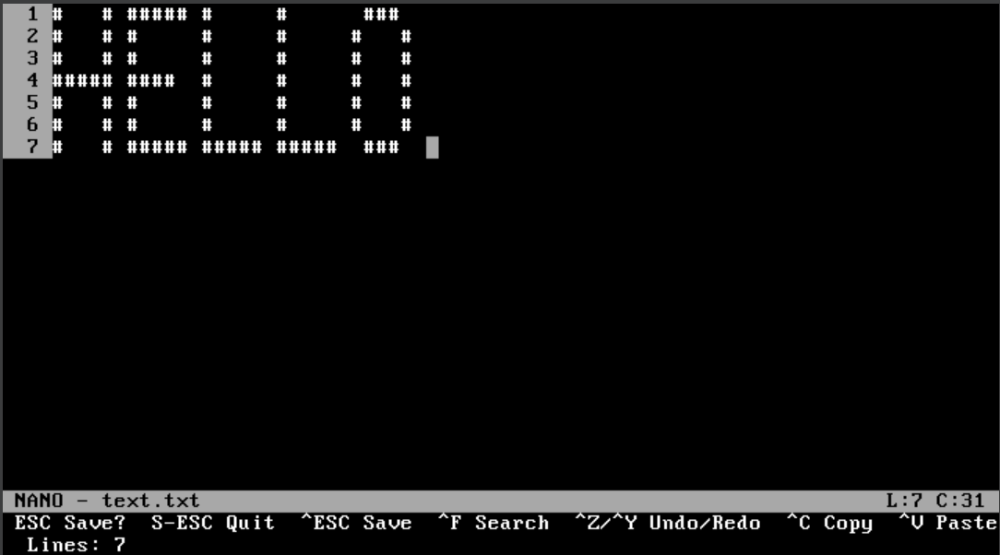
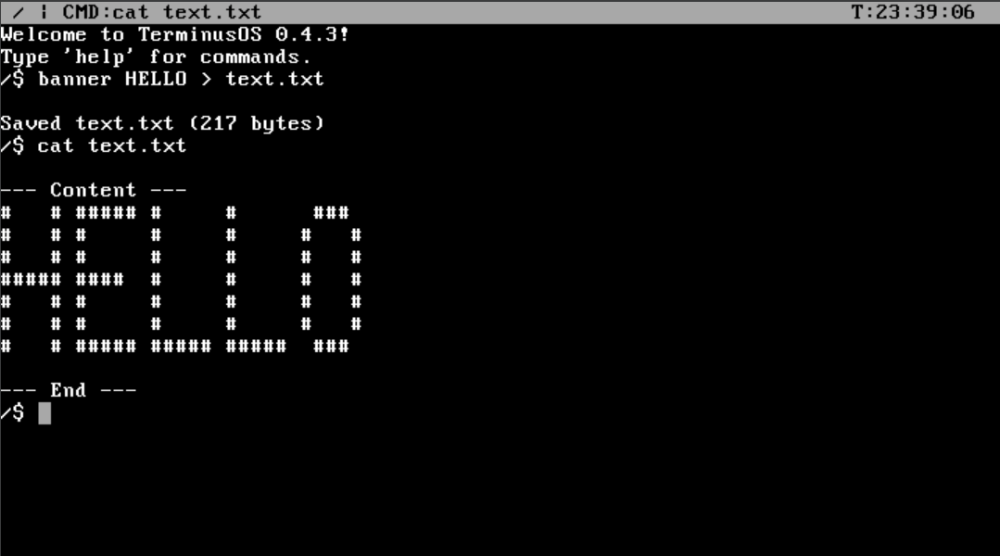
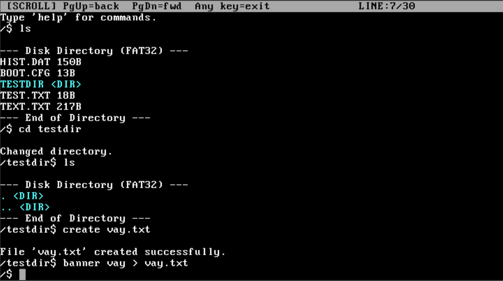
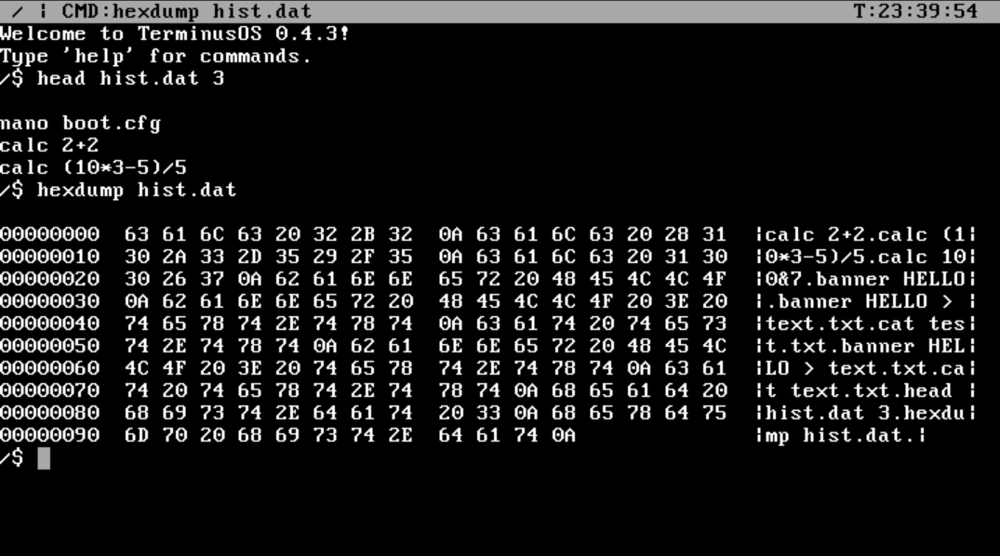

# 🛠 TerminusOS v0.4.3 — Quality of Life Update

> Incremental release focused on shell usability, editor improvements, new developer tools, and a reworked codebase structure.

---

## ⏱ `uptime` — System Uptime via RTC

Displays how long the system has been running, read directly from the **Real-Time Clock** — accurate regardless of CPU speed or emulator.

```
up 00:03:36  (now 23:35:35)
```



---

## 🧮 `calc` — Expression Calculator

Integer expression calculator with full operator support.

**Arithmetic & power:**



**Bitwise operations & hex literals:**



| Feature | Example | Result |
|---|---|---|
| Power | `calc 2**10` | `1024` |
| Bit shift | `calc 1 << 8` | `256` |
| AND | `calc 0xFF & 0x0F` | `15` |
| OR | `calc 0xDEAD \| 0x0010` | `57021` |
| XOR | `calc 0xFF ^ 0xAA` | `85` |
| NOT | `calc ~0xFF` | `-256` |
| Hex literals | `calc 0xFF & ~15` | `240` |

Results are shown in both **decimal and hex** automatically.

---

## 📝 Nano Editor Overhaul

The built-in text editor received a significant upgrade:

- **Larger buffer** — maximum lines increased from 20 to **200**
- **Vertical scrolling** — editor scrolls when content exceeds visible area
- **Line numbers** — 4-character gutter on the left
- **Undo / Redo** — up to 64 levels (`Ctrl+Z` / `Ctrl+Y`)
- **Text selection** — basic selection support added



---

## 🎨 `banner` — ASCII Art Text

Renders text using a built-in **5×7 bitmap font**. Supports A–Z, 0–9, and `! ? . -`.
Output can be redirected directly to a file:

```
banner HELLO > text.txt
```



---

## 🖥 Terminal Scrollback

A scrollback buffer stores up to **300 lines** of previous output.

- **`PgUp`** — scroll back (3 lines per step)
- **`PgDn`** — scroll forward
- Any other key returns to the live view
- Status bar shows position: `[SCROLL] PgUp=back  PgDn=fwd  Any key=exit  LINE:7/30`



---

## 📁 `ls` — Long Filename & Color Support

Directory listing now reads **FAT32 LFN entries** and applies **theme colors**:

- Directories shown in `theme_dir` color (cyan by default)
- Files shown in `theme_file` color

---

## 🔍 `head` & `hexdump` — File Inspection Tools

**`head <file> [N]`** — print the first N lines of a file (default: 10).

**`hexdump <file>`** — display raw file contents as a hex + ASCII dump.



---

## ➡ Output Redirection

Any command output can be written to a file using `>`:

```
echo Hello, World! > greet.txt
banner VAY > vay.txt
```

If the target file already exists it is overwritten. A confirmation with byte count is printed on success.

---

## 📊 `wc` — Word Count

Counts lines, words, and characters in a file:

```
wc text.txt
```

---

## 🏗 Architecture Refactor

Internal code layout reorganized for clarity and scalability:

| Change | Before | After |
|---|---|---|
| Command files | `drivers/commands/` | `commands/` (top-level) |
| Screen / Settings | `kernel/` | `lib/` |
| FAT32 driver | `fs/` | `drivers/` |
| Command dispatch | Scattered in `shell.cpp` | Centralized `commands/cmd_registry.cpp` |
| FAT16 support | Present | **Removed** (FAT32 only) |

The new `cmd_registry.cpp` holds a unified dispatch table — adding new commands requires editing only one file.

---

## 👨‍💻 Author

YouTube: [Zero Logic](https://www.youtube.com/@Zero-Logic-dev)  
Telegram: [@den2010991](https://t.me/den2010991)  
GitHub: [deniss123va](https://github.com/deniss123va)