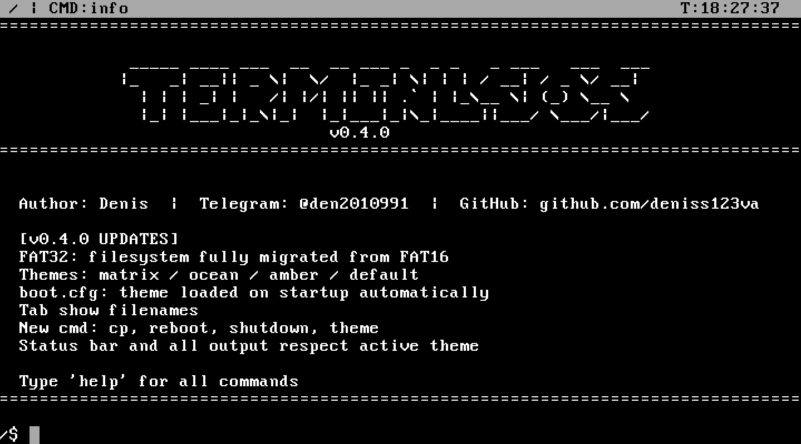
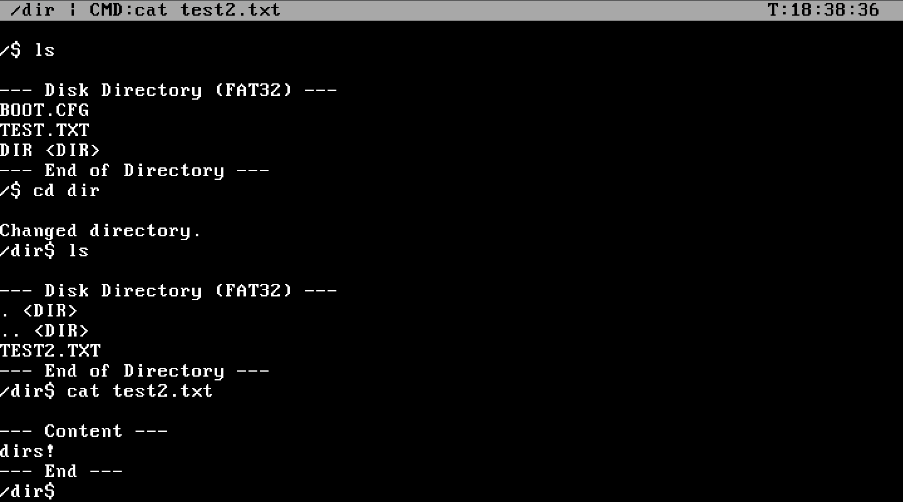
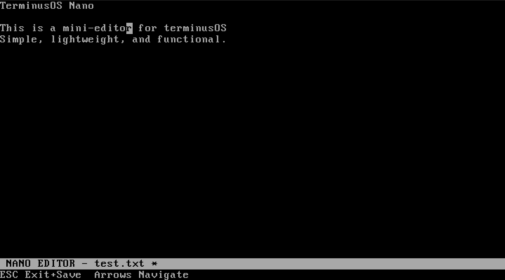
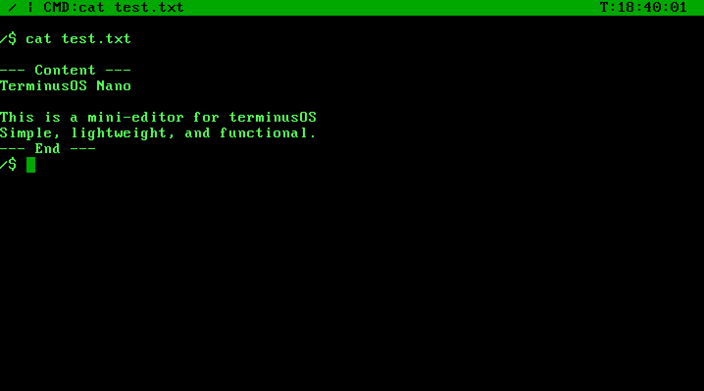
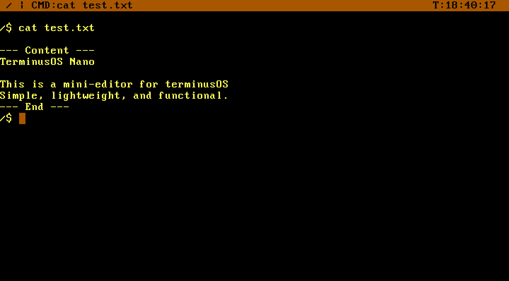
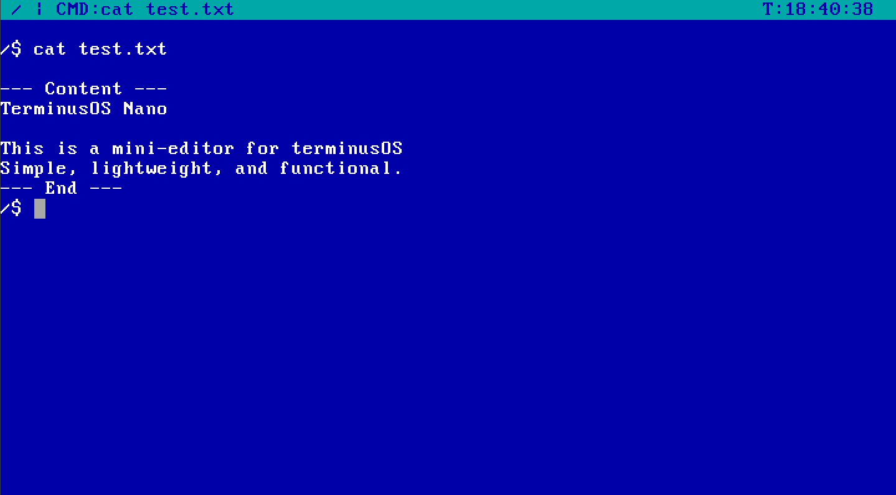
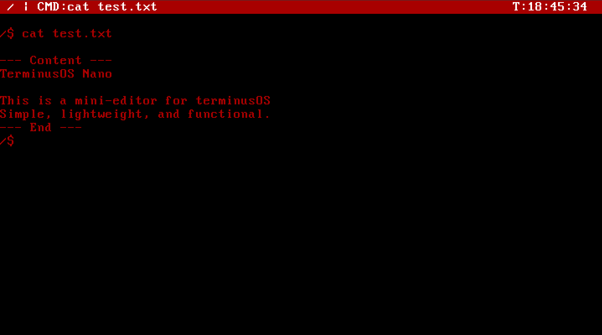
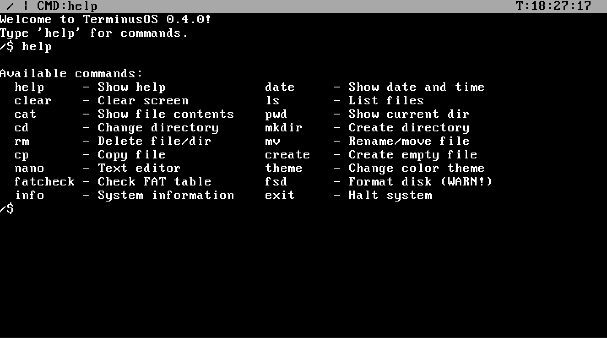
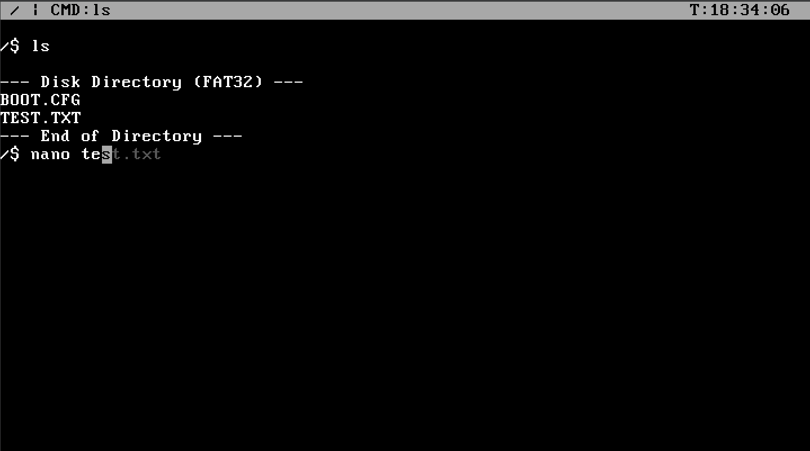

<!DOCTYPE html>
<html lang="en">
<head>
    <meta charset="UTF-8">
</head>
<body>

<h1>🌌 TerminusOS v0.4.0</h1>

<strong>TerminusOS</strong> is a hobbyist operating system developed from scratch in C++ and x86 Assembly. The project focuses on learning low-level hardware interaction, kernel architecture, and filesystem implementation.

<h2>🚀 Key Features (v0.4.0)</h2>

<ul>
    <li><strong>FAT32 Filesystem:</strong> Full support for reading, creating, deleting, and renaming files and directories.</li>
    
    <li><strong>"Nano" Text Editor:</strong> A built-in console editor supporting arrow-key navigation and direct disk saving.</li>
    
    <li><strong>Interrupt Handling:</strong> Implemented Interrupt Descriptor Table (IDT), handling CPU exceptions (ISR) and hardware interrupts (IRQ).</li>
    <li><strong>Keyboard Driver:</strong> Support for scan codes, Shift, Caps Lock, and functional keys.</li>
    <li><strong>UI Customization:</strong> Theme system (Classic, Matrix, Ocean) loaded via <code>boot.cfg</code>.</li>
    <li><strong>Real-Time Clock (RTC):</strong> CMOS integration to display system time and date in the status bar.</li>
</ul>

<h2>📂 Project Structure</h2>

<table border="1">
    <tr>
        <th>Directory</th>
        <th>Description</th>
    </tr>
    <tr>
        <td><code>kernel/</code></td>
        <td>Core logic: screen management, IDT, and <code>kmain</code> entry point.</td>
    </tr>
    <tr>
        <td><code>drivers/</code></td>
        <td>Hardware drivers: Keyboard, ATA (disk), and RTC.</td>
    </tr>
    <tr>
        <td><code>fs/</code></td>
        <td>FAT32 filesystem implementation logic.</td>
    </tr>
    <tr>
        <td><code>shell/</code></td>
        <td>Command-line interface and built-in system utilities.</td>
    </tr>
    <tr>
        <td><code>lib/</code></td>
        <td>Standard library: string manipulation and I/O port operations.</td>
    </tr>
</table>

<h2>🎨 Available Themes</h2>

    

        
        
Matrix

    

    

        
        
Amber

    

    

        
        
Ocean

    

    

        
        
Custom (Red/Black)

    

<h2>🛠 Technical Stack</h2>

<ul>
    <li><strong>Languages:</strong> C++, x86 Assembly.</li>
    <li><strong>Architecture:</strong> x86 (32-bit Protected Mode).</li>
    <li><strong>Toolchain:</strong> GCC Cross-Compiler.</li>
</ul>

<h2>⌨️ Shell Commands</h2>

<ul>
    <li><code>help</code> — Show available commands.</li>
    <li><code>info</code> — System and developer information.</li>
    <li><code>ls</code> — List directory contents.</li>
    
    <li><code>date</code> — Display current date and time.</li>
    <li><code>nano &lt;filename&gt;</code> — Launch the text editor.</li>
    <li><code>theme &lt;name&gt;</code> — Switch the visual color scheme.</li>
</ul>

<h2>⚠️ Error Handling</h2>

The system features a <strong>Kernel Panic</strong> mechanism. If a critical error or unhandled exception occurs (e.g., Division by Zero), the kernel halts the CPU and displays diagnostic information on a red background.

<h2>👨‍💻 Author</h2>

YouTube: <a href="https://www.youtube.com/@Zero-Logic-dev">Zero Logic</a>

Telegram: <a href="https://t.me/den2010991">@den2010991</a>

GitHub: <a href="https://github.com/deniss123va">deniss123va</a>

</body>
</html>
